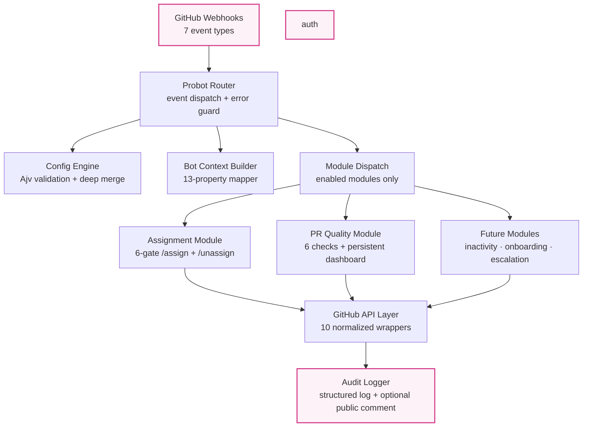
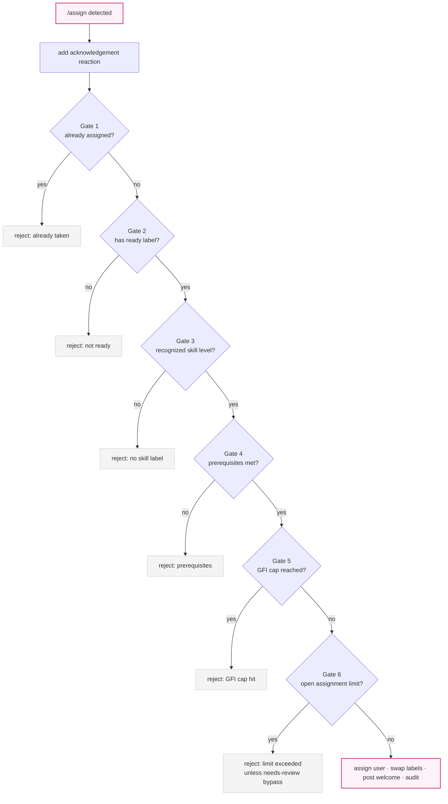
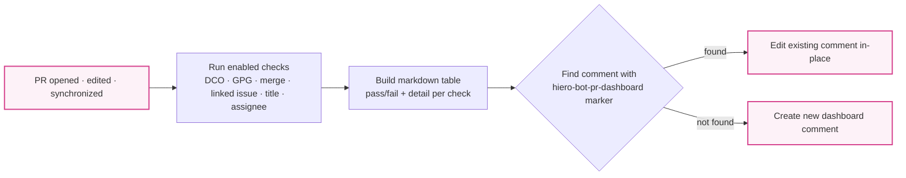
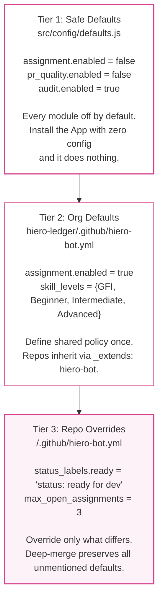

<p align="center">
  <a href="https://github.com/cheese-cakee/hiero-workflow-app">
    
  </a>
</p>
<p align="center"><strong>Hiero Workflow App</strong></p>
<p align="center">A reusable, config-driven GitHub App for automating maintainer workflows<br/>across the Hiero ecosystem.</p>

<p align="center">
  <a href="https://github.com/cheese-cakee/hiero-workflow-app/actions/workflows/ci.yml"></a>
  <a href="https://github.com/cheese-cakee/hiero-workflow-app/blob/master/LICENSE"></a>
  
  
  
</p>

---

## Why

The Hiero SDK org maintains 7+ repositories. Each has its own set of JavaScript
and Bash scripts for `/assign`, `/unassign`, stale issue tracking, PR quality checks,
and onboarding. These scripts are copy-pasted between repos, wired differently per
Actions workflow, and produce 5+ bot comments per PR with no unified audit trail.

The Hiero Workflow App replaces all of that with a **single GitHub App** and a
**single `.github/hiero-bot.yml` config file** per repository.

---

## How It Works



1. A GitHub event fires (e.g. `/assign` comment, PR opened).
2. The Probot router receives it, loads and validates repository config from `.github/hiero-bot.yml`.
3. Configuration is validated against a JSON Schema (Ajv), merged with org-level defaults via `_extends`.
4. The router dispatches to enabled modules only — each with its own error guard.
5. Modules enforce their gates, perform actions via the normalized GitHub API layer.
6. Every decision is logged to the audit trail with an optional public comment.

---

## What It Does Right Now

### Assignment — `/assign` and `/unassign`



| Gate | Rule | Rejection comment |
|------|------|-------------------|
| 1. Already assigned | Issue must not have existing assignees | "This issue is already assigned to @x" |
| 2. Ready label | Must have the configured "ready" label | "This issue is not ready for assignment" |
| 3. Skill level | Must match a configured skill tier | "This issue does not have a recognized skill level" |
| 4. Prerequisites | Must have completed N issues at lower tier | "You need more experience before tackling X issues" |
| 5. GFI cap | Can only complete X Good First Issues | "You've reached the limit of X GFIs" |
| 6. Assignment limit | Cannot exceed Y open assigned issues | "You have reached the assignment limit" |

On success: assigns the user, swaps status labels (ready → in progress), posts a welcome comment.
On failure: posts a specific, actionable comment explaining exactly what went wrong and why.

The **needs-review bypass** in Gate 6 is preserved faithfully from the C++ SDK: if all open
assigned issues have a PR with `status: needs review`, the limit is waived.

### `/unassign` — Three Gates

| Gate | Rule |
|------|------|
| Issue must be open | Cannot unassign from closed issues |
| Issue must have assignees | Nothing to unassign |
| Requester must be current assignee | Only the assignee can unassign themselves |

On success: removes the assignee, swaps status labels (in progress → ready), posts acknowledgement.

### PR Quality Dashboard



Every PR gets a **single persistent dashboard comment** that updates in-place on every push —
no comment spam. Uses the Renovate/Dependabot pattern: a hidden HTML marker identifies
which comment to edit. Draft PRs get an informational dashboard with an explainer note.

| Check | Source |
|-------|--------|
| DCO sign-off | Every commit has `Signed-off-by:` |
| GPG verification | Every commit is GPG signed |
| Merge conflicts | `mergeable` API field (null = pending) |
| Linked issue | PR body references an issue (`fixes #N`, bare `#N`) |
| Conventional title | `type(scope): description` format |
| Linked issue assigned | Referenced issue has an assignee |

---

## Configuration Inheritance



Validation occurs at every tier. Invalid config silently falls back to safe defaults.
No malformed YAML ever reaches a module's execution context. All 9 module schemas
enforce `additionalProperties: false` — typos in config keys are caught immediately.

---

## Configuration

Drop a file at `.github/hiero-bot.yml` in any installed repository:

```yaml
_extends: hiero-bot

assignment:
  enabled: true
  commands: [/assign, /unassign]
  max_open_assignments: 3
  status_labels:
    ready: "status: ready for dev"
    in_progress: "status: in progress"
  skill_levels:
    "skill: good first issue":
      max_completions: 5
      display_name: Good First Issue
    "skill: beginner":
      prerequisites:
        label: "skill: good first issue"
        min_completed: 2
      display_name: Beginner

pr_quality:
  enabled: true
  checks:
    dco: true
    gpg: true
    merge_conflict: true
    linked_issue: true
    conventional_title: true

audit:
  include_reason_in_comments: true
```

Org-level defaults live at `hiero-ledger/.github/hiero-bot.yml` and are inherited
via the `_extends` mechanism. Full reference: [`examples/hiero-bot.yml`](examples/hiero-bot.yml)

---

## Code Metrics

| Metric | Value | Note |
|--------|-------|------|
| Source modules | 20 (in `src/`) | |
| Lines of source code | ~2,700 | excl. tests & docs |
| Tests | 138 passed, 0 failed | |
| Line coverage | 94% | |
| Branch coverage | 84% | |
| Function coverage | 95% | |
| ESLint | 0 errors, 0 warnings | flat config |
| CI | Green | Node 20 + 22 matrix |
| Deployment | Docker + docker-compose + Fly.io | |

---

## Modules

| Module | Status | Description |
|--------|--------|-------------|
| Assignment | **Live** | 6-gate `/assign`, 3-gate `/unassign`, config-driven limits and prerequisites |
| PR Quality | **Live** | 6 configurable checks, persistent dashboard with HTML marker upsert |
| Inactivity | Planned | Cron-based stale warnings, auto-close, 30-day blocked check-in |
| Onboarding | Planned | First-time contributor detection and welcome flow |
| Escalation | Planned | Label-to-team notifications with cooldown |
| AI Planning | Stub | Advisory-only interface for LLM-generated issue breakdowns |
| AI Review | Stub | Advisory-only interface for LLM-generated PR reviews |

Every module — implemented or planned — follows the same 4-step contract:
create directory, add JSON Schema, add safe defaults, register in router.
No existing module is touched to add a new one.

---

## Mentorship Roadmap

| Phase | Dates | Focus |
|-------|-------|-------|
| **Phase 1** (current) | — | Assignment + PR Quality modules, config engine, audit system, test suite |
| **Phase 2** | Jun–Jul 2026 | Inactivity module + `/finalize` command + Onboarding + Escalation |
| **Phase 3** | Jul–Aug 2026 | Cross-repo deployment on 3+ SDK repos, rate-limit handling, Postgres migration |
| **Phase 4** | Aug–Sep 2026 | Documentation, adoption guides, real-world testing, community handoff |

This prototype was built as part of an
[LFX Mentorship proposal](https://github.com/cheese-cakee/hiero-workflow-app) for the
Hiero ecosystem. See [`docs/migration-guide.md`](docs/migration-guide.md) for the
transition plan from the existing fragmented workflow system.

---

## Technology

| Component | Choice | Why |
|-----------|--------|-----|
| Runtime | Node.js ≥ 20, CommonJS + JSDoc | Matches existing Hiero SDK bot scripts; zero build step |
| Framework | Probot v13 | GitHub App auth, webhook routing, `context.config()` |
| Validation | Ajv | JSON Schema with strict mode, `additionalProperties: false` |
| Testing | Jest | Same framework as the C++ SDK bot scripts |
| Deployment | Fly.io / Docker | Persistent server for scheduled sweep tasks |

---

## Development

### Quick Start

```bash
npm ci
cp .env.example .env
# Fill in APP_ID, WEBHOOK_SECRET, PRIVATE_KEY_PATH
npm run dev
```

### GitHub App Setup

1. [Create a GitHub App from manifest](https://github.com/settings/apps/new?url=https://raw.githubusercontent.com/cheese-cakee/hiero-workflow-app/master/app.yml)
2. Generate a private key, save as `private-key.pem`
3. Install the App on a test repository
4. Drop `examples/hiero-bot.yml` into `.github/hiero-bot.yml`

### Webhook Proxy

For local development, use [localtunnel](https://github.com/localtunnel/localtunnel):

```bash
# Terminal 1
npm start                    # Probot on :3000

# Terminal 2
npx localtunnel --port 3000  # Public URL → localhost
```

Then update the App's webhook URL to `https://<tunnel>.loca.lt/api/github/webhooks`.

### Commands

```bash
npm start          # Production (probot run)
npm run dev        # Development (nodemon)
npm test           # Jest (138 tests)
npm run coverage   # Jest with coverage report
npm run lint       # ESLint (zero tolerance)
npm run setup      # Interactive setup wizard
```

---

## Project Structure

```
.
├── src/
│   ├── index.js                # Probot entry point + GET /health
│   ├── router.js               # 7-event dispatcher with error guard
│   ├── audit.js                # Structured logger + optional public comments
│   ├── config/
│   │   ├── schema.js           # Ajv JSON Schema (all 9 modules)
│   │   ├── loader.js           # context.config() + deepMerge + safe defaults
│   │   └── defaults.js         # All modules disabled (safe baseline)
│   ├── helpers/
│   │   ├── github.js           # 10 Octokit wrappers (normalized {success, error?})
│   │   ├── context.js          # Probot payload → botContext mapper (13 props)
│   │   └── logger.js           # Pino child logger factory
│   └── modules/
│       ├── assignment/         # /assign + /unassign (comments, eligibility)
│       └── pr-quality/         # Checks + persistent dashboard editor
├── tests/
│   ├── helpers/                # github.test.js, context.test.js
│   ├── config/                 # schema.test.js, loader.test.js
│   ├── modules/                # assignment.test.js, pr-quality.test.js, router.test.js
│   └── fixtures/               # 5 Probot-compatible webhook payloads
├── docs/
│   ├── getting-started.md      # Step-by-step setup guide
│   └── migration-guide.md      # Old workflow → new module mapping
├── examples/hiero-bot.yml      # Annotated reference config (schema-validated)
├── Dockerfile                  # Node 22 Alpine + HEALTHCHECK + least-privilege
├── docker-compose.yml          # Secrets-based key injection
├── fly.toml                    # Fly.io deployment with health checks
├── app.yml                     # GitHub App manifest
├── eslint.config.js            # Flat config (zero warnings)
├── jest.config.js              # 70% branch / 80% line+func+stmt thresholds
└── scripts/setup.js            # Interactive setup wizard
```

---

## Links

- [Getting Started Guide](docs/getting-started.md)
- [Migration Guide](docs/migration-guide.md)
- [Example Configuration](examples/hiero-bot.yml)
- [LFX Mentorship Issue #73](https://github.com/hiero-ledger/hiero-website/issues/73)

---

## License

Apache 2.0
